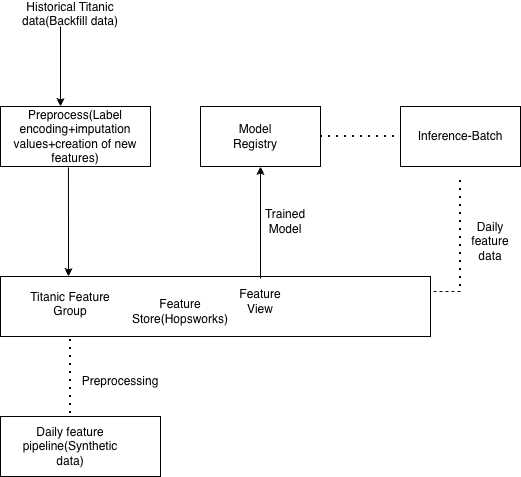

## End-to-End MLOps Project: Titanic Survival Prediction

This project implements an end-to-end batch ML system for predicting passenger survival on the Titanic dataset.

### Stack
- **Feature Store & Model Registry:** Hopsworks
- **Language:** Python 3.11
- **Environment Management:** uv
- **Model:** XGBoost

### Architecture
